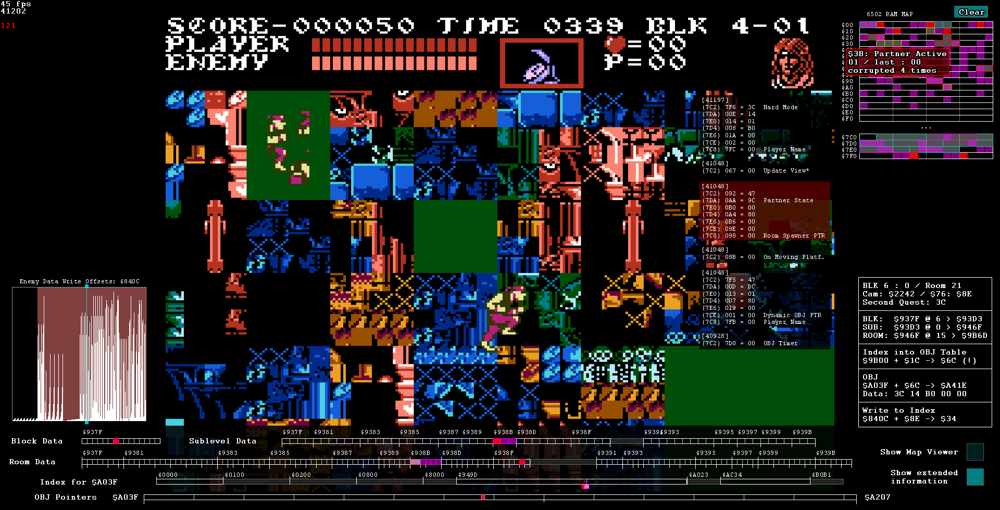
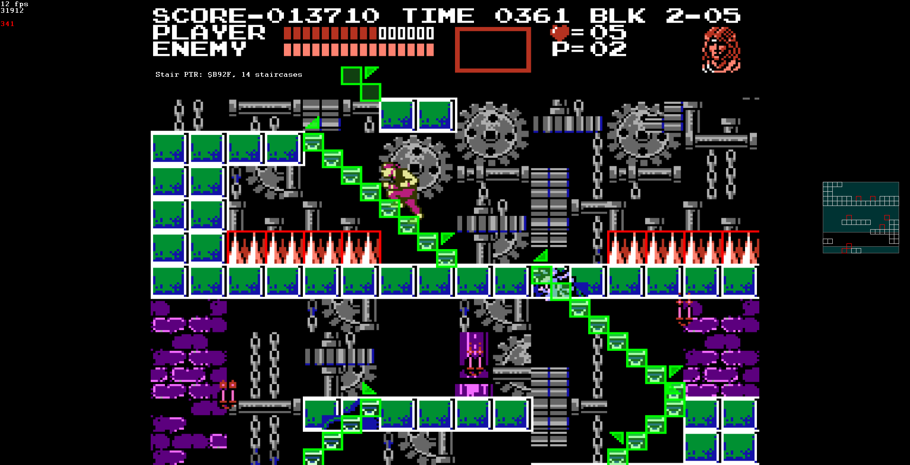

# Castlevania III Memory Corruption Tools

This directory contains scripts for exploring and glitch hunting in Castlevania 3.
The following scripts are included:

- Corruption Visualizer (cv3-corruption-visualizer.lua)
- Map Viewer (cv3-map-viewer.lua)

Supported ROMs:

- Castlevania 3 - Dracula's Curse (U) (SHA1: 23C4DAFCC17FA75E8D682931702277659CD59735)
- Akumajou Densetsu (J) (SHA1: BEB7E005BCBAC031CE61613FA47DF24AD151E9AB)

Supported Emulators:

- BizHawk 2.9.1 (NesHawk core)

### Corruption Visualizer

The corruption visualizer showcases the effects of memory corruption on the game's memory, caused by an invalid camera position.
This can be achieved by disaligning the character from a staircase and entering invalid rooms, at which point, numerous strange effects can happen, including warp glitches to the final level of the game.

The corruption visualizer informs you when corruption happens and displays a heatmap of RAM that shows which values get corrupted.
Some values have been given names to quickly identify their function.
Additionally, the corruption visualizer showcases the moving parts that are involved in determining what values get loaded.
The script also includes an on-screen map viewer to help with navigation in the glitched worlds.

### Map Viewer

This script is a stand-alone version of the map viewer in the corruption visualizer.
It displays the game's collision data on the screen.
This is useful when navigating the glitched worlds, because tiles are often not visible.
Additionally, walkable stairs are displayed on screen.
The map viewer also displays the contents of the tile buffer stored at `$6E0`, which can be useful for corrupting tile geometry through scroll glitching.

## Usage and Limitations

To use these scripts, start up BizHawk and load either script.
Do not run both scripts together, instead, if you wish to use the map viewer from within the corruption visualizer, enable the option inside the script.

Interactive widgets are displayed on screen, which either reveal more information when hovered with the mouse, or trigger additional functionality when clicked.

__Note__: These scripts are designed for running with BizHawk in maximized mode with a 1920x1080 display.
A lot of space to the left and right side of the screen is required to show all the relevant information for the corruption visualizer.
If your display is different, you must edit the position values inside the script.

__Note__: If you want to copy these scripts to another location, make sure to copy the entire directory and all files contained within, as the scripts include the other scripts within the subdirectories.
If you are accessing this repository from GitHub, either clone the repository or download it as a zip file.

If you wish to edit the scripts, make sure to always close and re-open BizHawk's Lua console between each edit, as parts of the script will otherwise not be reloaded properly.
I recommend binding the Lua console to a BizHawk hotkey if you intend to edit the script a lot.

There are a still few limitations and known issues:

- Any time memory corruption occurs, more memory values are corrupted than the visualizer shows, between `$400` and `$6FF`. Most values in this range are related to player and enemy data. Accounting for this will mean going through the relevant portions of the game's assembly code, which have not been analyzed yet.
- Using the map viewer or enabling the extended information panel can cause significant slowdown on BizHawk 2.9.1 and earlier. As of this writing, current dev builds of BizHawk improve this a lot.

## Acknowledgements

Massive thanks go out to the BizHawk team for their continued work on an amazing emulator.

During the making of these scripts, I heavily consulted two online resources for reference:

- [Castlevania 3 Disassembly](https://github.com/vinheim3/castlevania3-disasm) by vinheim3, hosted on GitHub
- [Castlevania III: RAM Map](https://datacrystal.tcrf.net/wiki/Castlevania_III:_Dracula%27s_Curse/RAM_map) courtesey of https://datacrystal.tcrf.net